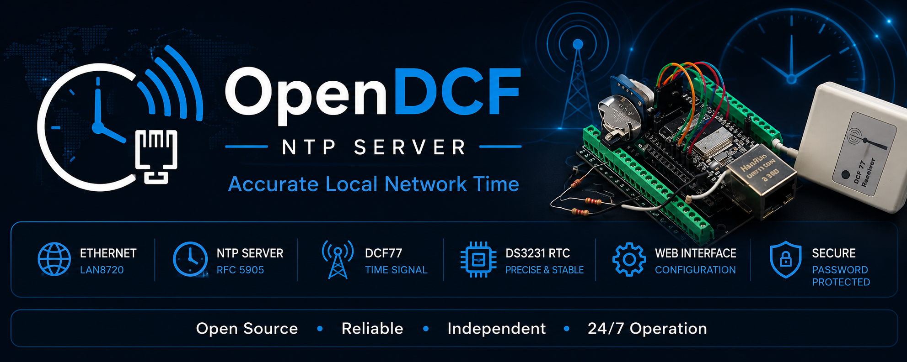
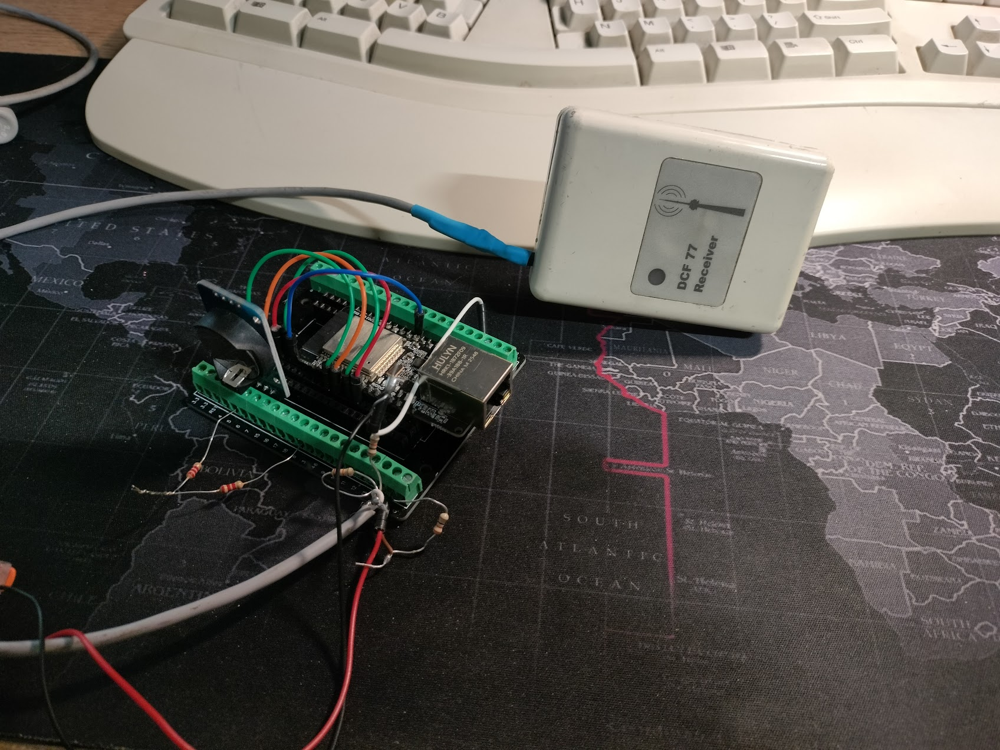
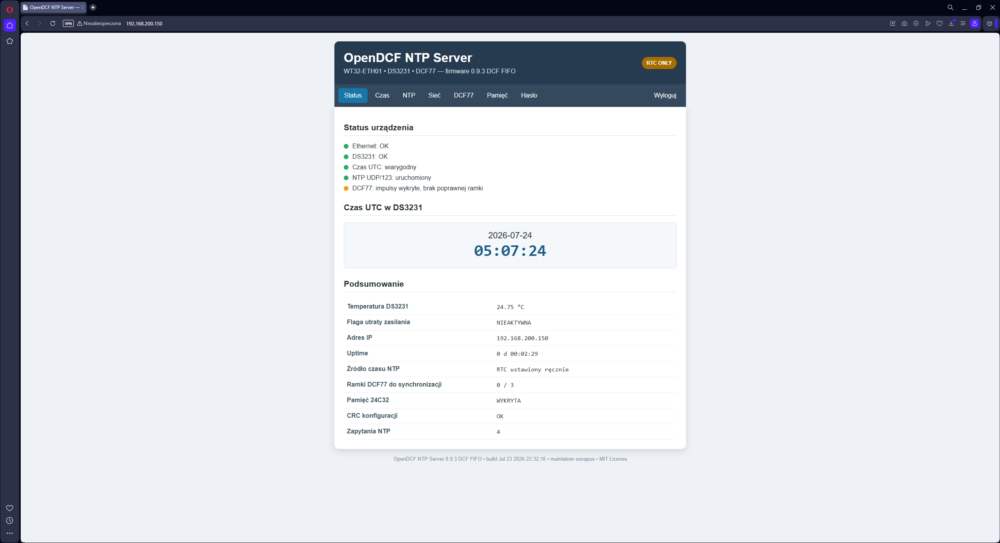

# OpenDCF NTP Server



[](https://github.com/osnapus/OpenDCF/releases)
[](https://github.com/osnapus/OpenDCF)
[](LICENSE)
[](https://github.com/osnapus/OpenDCF)

**OpenDCF** is a standalone Ethernet NTP server based on the WT32-ETH01, a DS3231 real-time clock and a DCF77 receiver. It provides an independent time source for a local network and is designed for continuous, unattended operation.




## Features

- Ethernet NTP/SNTP server on UDP port 123
- WT32-ETH01 with LAN8720 Ethernet PHY
- DS3231 RTC used as the local time reference
- DCF77 frame decoding with parity, date and CET/CEST validation
- RTC synchronization after three consecutive valid DCF77 frames
- FIFO-based DCF77 edge acquisition and automatic recovery after signal loss
- DS3231 SQW 1 Hz monitoring for precise NTP timestamp generation
- Public web status page
- Password-protected configuration pages
- DHCP or static IPv4 configuration
- Manual RTC setting from the browser
- 24C32 EEPROM configuration storage with CRC32
- Persistent boot and DCF synchronization statistics
- Compatibility tested with common NTP clients, including MikroTik RouterOS
- Optional I2C 1602 LCD display to show time, date, IP adress etc.

## Hardware

- WT32-ETH01
- DS3231 RTC module with 24C32 EEPROM
- DCF77 receiver module
- 4.7–10 kΩ pull-up resistor for the DS3231 SQW signal
- Suitable level adaptation for a 5 V DCF77 data output
- Regulated power supply
- 1602 LCD display (optional)

### Connections

| Signal | WT32-ETH01 pin | Notes |
|---|---:|---|
| DS3231 SDA | GPIO33 | I²C data |
| DS3231 SCL | GPIO32 | I²C clock |
| DS3231 SQW | GPIO36 | 1 Hz output; external pull-up to 3.3 V required |
| DCF77 DATA | GPIO35 | Use appropriate 5 V to 3.3 V level adaptation |
| DS3231 VCC | 3.3 V | According to the tested prototype |
| GND | GND | Common ground |

The Ethernet PHY configuration used by the firmware is:

| Function | GPIO |
|---|---:|
| PHY address | 1 |
| MDC | 23 |
| MDIO | 18 |
| PHY power | 16 |
| Clock | GPIO0 input |

## Default network configuration

| Setting | Default value |
|---|---|
| Hostname | `opendcf-ntp` |
| IPv4 address | `192.168.200.150` |
| Netmask | `255.255.0.0` |
| Gateway | `192.168.200.254` |
| DNS 1 | `8.8.8.8` |
| DNS 2 | `1.1.1.1` |
| HTTP port | `80` |
| NTP port | `123/UDP` |
| Initial administrator password | `admin` |

Change the default administrator password after the first login.

## How it works

```text
DCF77 receiver
      │
      ▼
Interrupt edge FIFO
      │
      ▼
Pulse and polarity decoder
      │
      ▼
DCF77 frame validation
      │
      ▼
DS3231 RTC (UTC)
      │
      ├── Web status and configuration
      │
      └── NTP server over Ethernet
```

The DS3231 stores UTC. A valid DCF77 time is accepted only after three consecutive complete frames. The firmware also rejects an automatic correction when the difference between RTC and DCF77 exceeds ten minutes, preventing an unexpected large time jump.

## Building and uploading

1. Install the ESP32 board package in Arduino IDE.
2. Install the **RTClib** library by Adafruit.
3. Open:
   `firmware/OpenDCF_NTP_Server_v1.0.0.ino`
4. Select an ESP32 board configuration suitable for the WT32-ETH01.
5. Compile and upload the sketch.
6. Connect Ethernet and open the device IP address in a web browser.
7. Verify RTC, SQW and DCF77 status before using the device as an NTP source.

The remaining dependencies (`ETH`, `WebServer`, `NetworkUdp`, `Wire` and mbedTLS) are supplied by the ESP32 Arduino core.

## First start

1. Power the WT32-ETH01 and connect it to the LAN.
2. Open `http://192.168.200.150/` when using the default static configuration.
3. Set the RTC manually if it does not yet contain valid time.
4. Log in with the initial password `admin` and change it.
5. Configure DHCP or static addressing as required.
6. Place the DCF77 antenna away from switching power supplies, displays and Ethernet hardware.
7. Wait for three consecutive valid frames before the first automatic DCF77 synchronization.
8. Configure network clients to use the OpenDCF IP address as their NTP server.



## Repository structure

```text
OpenDCF/
├── firmware/
│   └── OpenDCF_NTP_Server_v1.0.0.ino
├── hardware/
├── images/
│   ├── banner.png
│   └── prototype.png
├── CHANGELOG.md
├── LICENSE
├── README.md
└── .gitignore
```

The `hardware` directory is reserved for future schematic and PCB files.

## Roadmap

Planned for a future release:

- Optional 16×2 I²C LCD support
- Automatic display detection
- Local status screens
- Published schematic and PCB documentation

## Security

The public status page does not require authentication. Configuration pages are protected by a password. The password is stored in the 24C32 as a salted SHA-256 hash, not as plain text.

OpenDCF is intended for trusted local networks. Do not expose its web interface directly to the public Internet.

## License

This project is released under the [MIT License](LICENSE).

## Author

**Piotr Antos** — project creator, hardware integration and testing.

## Acknowledgements

OpenDCF was developed through many iterations of hardware testing, firmware debugging and long-term reliability improvements. ChatGPT by OpenAI was used as an engineering assistant during firmware development and documentation.
